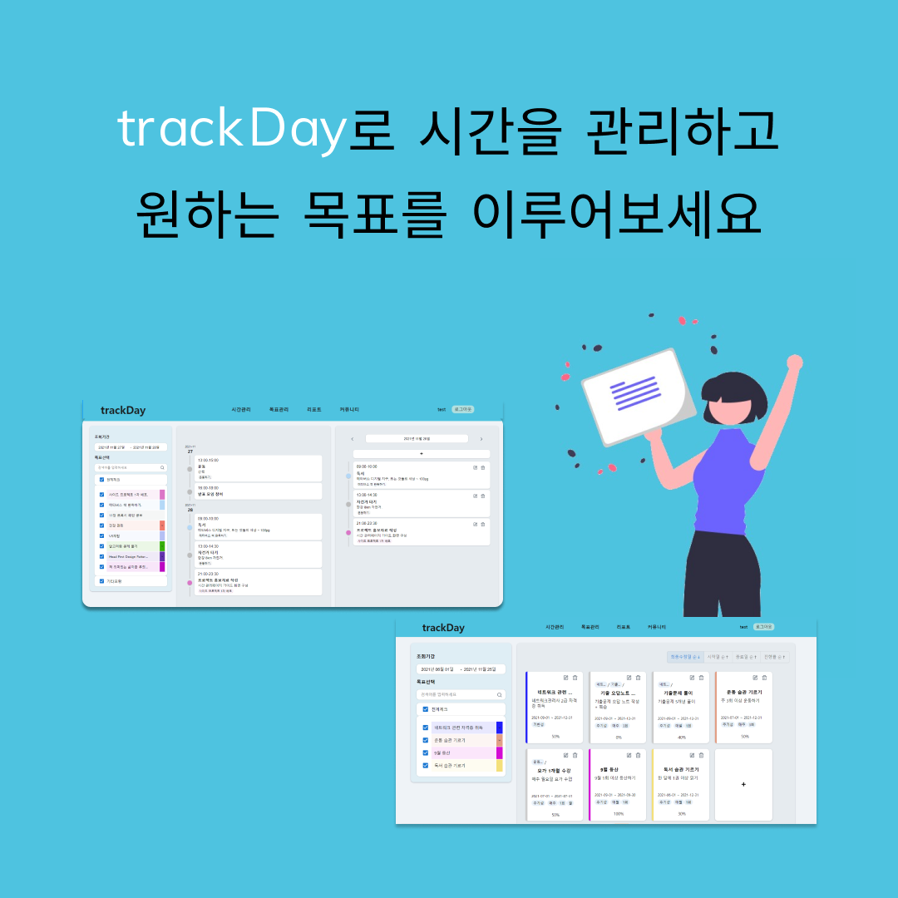
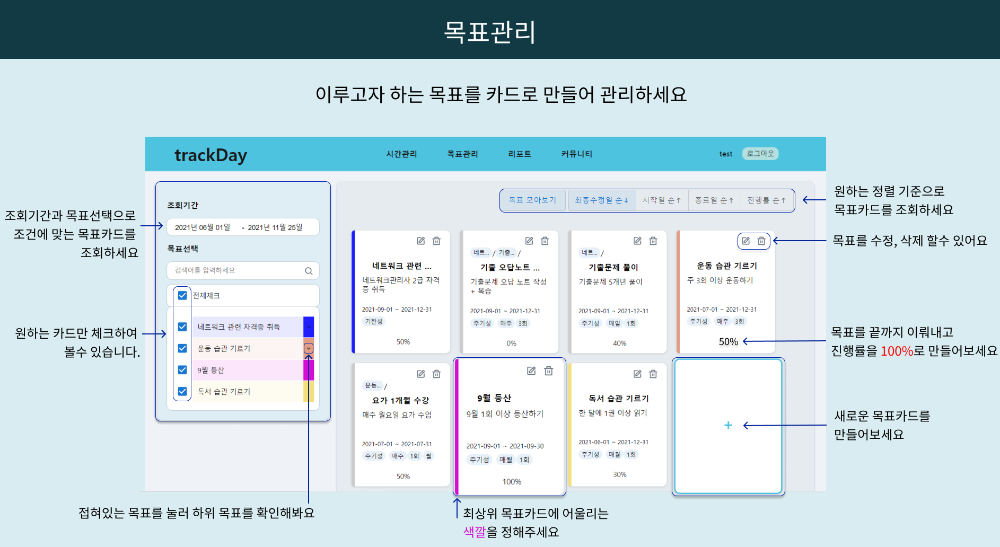
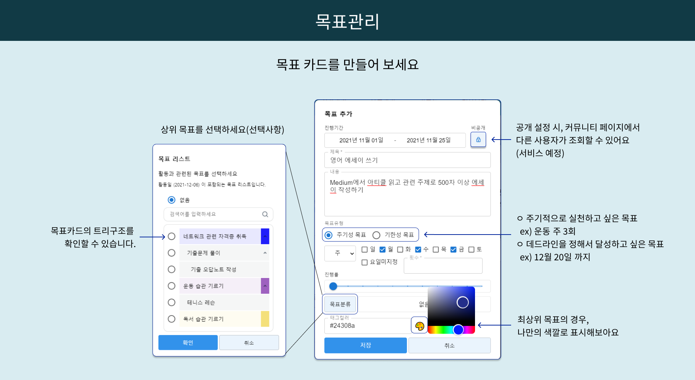
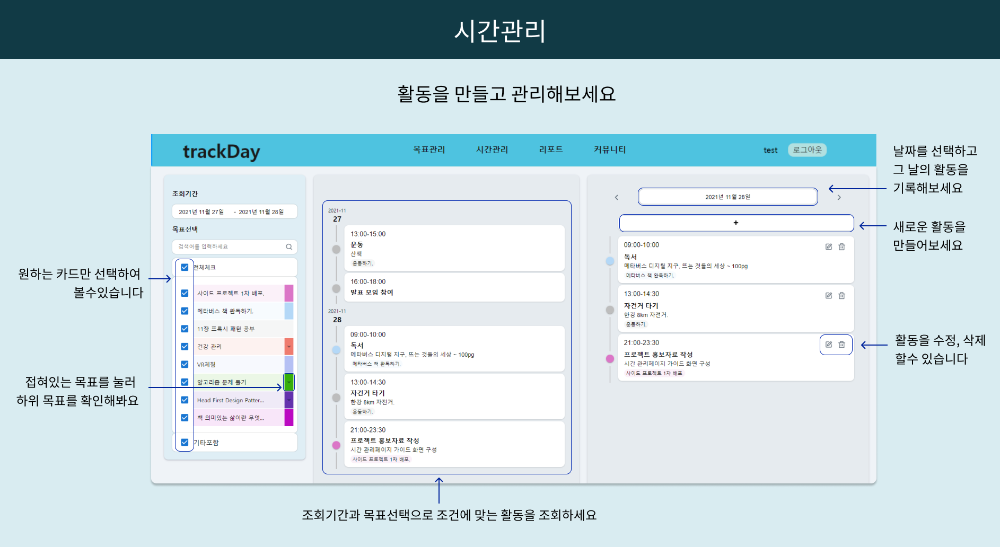
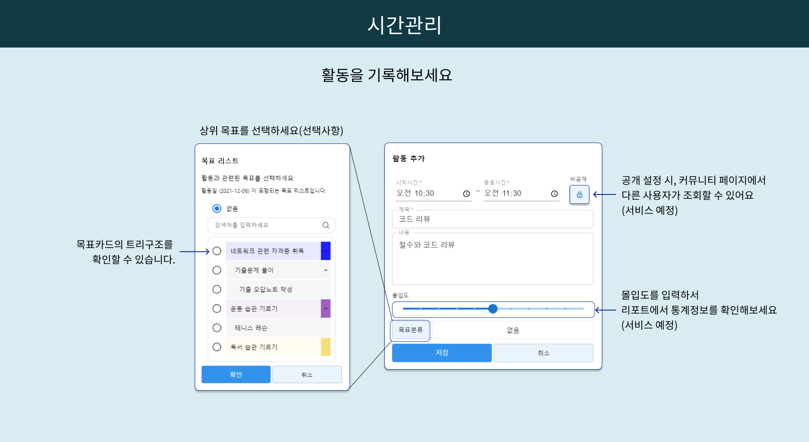

# trackDay



## 🗂️ 목차

### 1. [프로젝트 소개](#-프로젝트-소개)

### 2. Demo 링크

### 3. [제작 기간 & 팀 구성](#-팀-구성)

### 4. [기술 스텍 및 라이브러리](#-기술-스텍-및-라이브러리)
#### 4.1 Frontend
#### 4.2 Backend

### 5. ERD

### 6. [주요 기능](#-주요-기능)

### 7. [Troubleshooting](#-Troubleshooting)
#### 7.1 Frontend
#### 7.2 Backend

### 8. 회고
#### 8.1 Frontend

#### 8.2 Backend

### 9. 그외
#### 9.1 [유저 피드백 및 개선 사항](#-유저-피드백-및-개선-사항)

#### 9.2 실행 방법

#### 9.3 license

<hr>

## 📃 프로젝트 소개

trackDay는 이루고자 하는 목표를 관리하고, 매일의 활동을 기록하는 사이트 입니다. 다양한 관점에서의 리포트를 제공하여 유저들에게 동기를 부여하고, 지속적으로 도전할 수 있도록 합니다. 유저들간의 커뮤니티 기능을 통해 서로의 목표와 활동을 공유할 수 있습니다.   
이 외 다양한 기능들을 추가하여 목표를 이루는데 도움이 되고자 합니다.  

### 📆 개발 기간 : 2021년 08월 31일 ~

### 홈페이지 [trackDay](http://52.79.223.169:8080/)

### Github [Organizations](https://github.com/dongseoki/trackdayb)
-> 공개레포로 전환 필요

<hr>

## 🧑‍💻 팀 구성

<table>
  <tr>
  <td align="center">
  Backend
  </td>
  <td align="center">
  Frontend
  </td>
  <tr>
    <td align="center" >
    <b>이동석</b></a><br>
    <a href="https://github.com/dongseoki">Github</a>
    <br>JAVA<br>
    </td>
    <td align="center">
    <b>김유진</b></a><br />
    <a href="https://github.com/eugenekk" >Github</a>
    <br>REACT<br>
    </td>
    </tr>
</table>

<hr>

## ⭐ 기술 스텍 및 라이브러리

- 개발언어: JAVA, JavaScript
- 개발 라이브러리: React
- 배포 :
  - AWS EC2 : IaaS. Amazon으로 부터 물리적 서버, 네트워크, 가상화를 지원받음.
  - AWS RDS : AWS 클라우드에서 관계형 데이터베이스를 더 쉽게 설치, 운영 및 확장할 수 있는 웹 서비스
- DBMS :
  - mysql : 오픈 소스의 관계형 데이터베이스 관리 시스템
- 통신 :
  - Axios: 서버 통신을 위해 사용
- 스타일 :
  - styled-components : 가독성 및 편의성을 위해 사용
- 프레임워크 : 
  - spring boot : 자바 기반의 웹 어플리케이션을 만들수 있는 프레임 워크
  - spring security : Spring 기반의 애플리케이션의 보안(인증과 권한, 인가 등)을 담당하는 스프링 하위 프레임워크
  - mybatis : 개발자가 지정한 SQL, 저장프로시저 그리고 몇가지 고급 매핑을 지원하는 퍼시스턴스 프레임워크
- 라이브러리(패키지) :
  - React-Slick : Carousel 기능과 LazyLoad 기능을 통해 서버 효율성을 높이기 위해 사용
  - Moment : 시간 및 날짜 설정을 위해 사용
  - lombok : 어노테이션 기반으로 코드를 자동완성 해주는 라이브러리
  - javax.validation :  오브젝트 레벨의 제약 선언 및 유효성 검사 기술
  - swagger : API 문서 자동화를 지원하는 라이브러리
  - gson : Java에서 Json을 파싱하고, 생성하기 위해 사용되는. 구글에서 개발한 오픈소스
  - commons-lang3 :  java.lang API를 위한 수많은 도우미 유틸리티, 특히 문자열 조작 메서드, 기본 수치 메소드, 객체 반사, 동시성, 생성 및 직렬화, 시스템 속성을 제공
  - commons-collections4 : collection과 관련된 새로운 인터페이스, 구현체 및 유틸리티를 제공함으로써 JDK 클래스를 기반으로 빌드하는 것을 추구.
<hr>

## 🕹️ 주요 기능

### 로그인 / 회원가입

- JWT 토큰 방식으로 토큰을 발급받고 LocalStorage에 저장하여 사용한다.
- 영문 소문자, 숫자, 특수기호를 이용하여 아이디와 비밀번호를 설정할 수 있다.
- 닉네임을 입력할 수 있으며, 커뮤니티를 이용하는 모든 곳엔 닉네임만 노출된다.

### 목표관리

- 목표를 카드로 만들어 관리한다.
- 원하는 조건에 맞게 목표카드를 필터링 걸 수 있다.
- 목표카드에는 진행기간/공개여부/제목/내용/목표유형(주기성/기한성)/진행률/부모목표/태그컬러를 설정할 수 있다.



### 시간관리

- 활동을 타임라인형식으로 기록,저장한다.
- 원하는 조건에 맞게 활동 타임라인을 필터링 걸 수 있다.
- 활동에는 시간/공개여부/제목/내용/몰입도/관련목표를 기록한다.



<hr>

## 🙉 Troubleshooting (예시)

### 1. 하위 컴포넌트의 이벤트로 상위 컴포넌트의 state 변경 문제

- 상위 컴포넌트에 이벤트를 생성하여 Prop로 전달하는 방법 -> driling 이슈 발생

```jsx
const [state, setState] = useState(false);

const render = temp => {
  setState(temp);
};
```

- history로 props를 전달하고, uselocation을 활용하여 데이터를 전달하는 방법  
  -> 변경이 필요한 데이터의 관리가 어렵고, 컴포넌트 구조가 복잡해짐에 따라 사용이 제한적

```jsx
const goToMulti = () => {
  history.push({
    pathname: "/multi",
    state: { multiId: multiId },
  });
};
```

- **모든 페이지의 paramsId를 Redux Store에 저장하여 필요시 사용하는 방법울 사용하여 해결**

```jsx
const paramsSlice = createSlice({
  name: "params",
  initialState,
  reducers: {
    SetParams: (state, action) => {
      state.paramsId = action.payload;
    },
  },
});
```

```jsx
useEffect(() => {
  dispatch(DetailDB(multiId));
  dispatch(SetParams(multiId));
}, [dispatch, multiId]);
```

<hr>

## 🔧 유저 피드백 및 개선 사항 (예시)

### 피드백 정리 [Notion](https://crawling-health-e0d.notion.site/1e6a76553d3b45909c134d9b62b604fd)

1. 자체 피드백
2. 1차 유저 피드백 (지인) 21/11/15 ~ 21/11/22
3. 2차 유저 피드백 (각종 커뮤니티) 21/11/27 ~ 21/11/30

## 개선 사항
